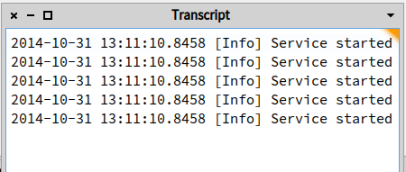

# Publish-Subscribe
(based on the [offical python tutorial](https://www.rabbitmq.com/tutorials/tutorial-three-python.html))

This communication pattern allows sending the same message to more than one receiver. 


For this tutorial, you'll set up a logging system with two subscribers, one will receive the log messages and print them on the Transcript and the other one will open a toast indicating that a new log message arrived.

For more information on the pattern see [publish-subsribe](https://www.enterpriseintegrationpatterns.com/patterns/messaging/PublishSubscribeChannel.html).

## Introducing the exchange 

Simply an exchange receives messages from producers y pushes them to queues. It will be configured to know what to do with a message according to its type.

Let's examine part of one of the logger's code, after creating the channel now you'll see 

````Smalltalk
channel declareExchangeNamed: 'logs' of: 'fanout' applying: [:exchange | ].
queue := channel declareQueueApplying: [ :builder | builder beExclusive ].
channel queueBind: queue method queue exchange: 'logs' routingKey: ''.
````

These collaborations will create an exchange named `logs`, a queue, and a binding between the two.

Binding the exchange can be interpreted as a known address where the producer will send messages, to the queue from where the consumer will take out the messages. 

Notice that the declared exchange is of type `fanout`, meaning published messages are going to be broadcast to all the bound queues.

## Logging to the Transcript

This is the complete code for spawning a logger that will receive log messages and post it to the Transcript

```Smalltalk
| connection channel result logger |

connection := AmqpConnectionBuilder new
	hostname: 'localhost';
	build.
connection open.

channel := connection createChannel.
channel declareExchangeNamed: 'logs' of: 'fanout' applying: [:exchange | ].
result := channel declareQueueApplying: [ :queue | ].
channel queueBind: result method queue exchange: 'logs' routingKey: ''.
channel 
	consumeFrom: result method queue
	applying: [ :messageReceived | Transcript show: ('<1s><n>' expandMacrosWith: messageReceived body utf8Decoded) ].	

logger := Process
				forContext:
					[ [ [  connection waitForEvent ] repeat ]
						ensure: [ connection close ]
					] asContext
				priority: Processor activePriority.
logger name: 'Transcript logger'.
	
logger resume 
```

## Receiveing notifications

This is the complete code for spawning a process that will pop up a toast notification on every log message received

```Smalltalk
| connection channel result logger |

connection := AmqpConnectionBuilder new
	hostname: 'localhost';
	build.
connection open.

channel := connection createChannel.
channel declareExchangeNamed: 'logs' of: 'fanout' applying: [:exchange | ].
result := channel declareQueueApplying: [ :queue | ].
channel queueBind: result method queue exchange: 'logs' routingKey: ''.
channel 
	consumeFrom: result method queue
	applying: [ :messageReceived | self inform: 'A log message has arrived!' ].		

logger := Process
				forContext:
					[ [ [  connection waitForEvent ] repeat ]
						ensure: [ connection close ]
					] asContext
				priority: Processor activePriority.
logger name: 'Transcript logger'.
	
logger resume 
```

## Producing logs

This is the script to produce log entries. Unlike the previous tutorial, you'll be publishing messages to the exchange, not directly to a queue

```smalltalk
| connection channel result |

connection := AmqpConnectionBuilder new
	hostname: 'localhost';
	build.
connection open.

channel := connection createChannel.
channel declareExchangeNamed: 'logs' of: 'fanout' applying: [:exchange | ].

channel basicPublish: '2014-10-31 13:11:10.8458 [Info] Service started up' utf8Encoded exchange: 'logs' routingKey: ''.	
channel
```

## Running the example

Ok, we will be using two Pharo images. Let's open two Playgrounds and the Transcript in the one actins as the loggers and copy and evaluate the 

On every message sent on the subscriber's imagage Transcript you'll see a new line being added



Also, you'll recive a notification like this one


## Next 

On the next tutorial learn how to refine this example, let's learn the basics of [routing](Routing.md).
