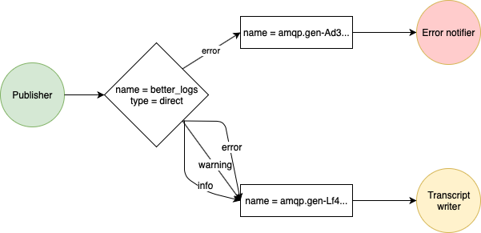

# Routing 
(based on the [offical python tutorial](https://www.rabbitmq.com/tutorials/tutorial-four-python.html))

This communication pattern allows send messages to an specfic route. 



On this tutorial, you'll refine the logging example you did on [PublishSubscribe.md] by sending selectively some of the log messages to a specific error logger. 

Log messages have a severity: `info`, `warning` or `error`.

## Direct exchange

At the code level the changes are minor, you will create a exchange of type `direct` instead of `fanout`. A direct exchange send messages to the queues whose binding key is equal to the routing key of the message.

And you'll be using the severity labels as binding keys! 

## Logging just errors messages to the Transcript

This is the complete code for spawning a logger that will receive error messages and post it to the Transcript

```Smalltalk
| connection channel result logger |

connection := AmqpConnectionBuilder new
	hostname: 'localhost';
	build.
connection open.

channel := connection createChannel.
channel declareExchangeNamed: 'logs' of: 'direct' applying: [:exchange | ].
result := channel declareQueueApplying: [ :queue | ].
channel queueBind: result method queue exchange: 'logs' routingKey: ''.
channel 
	consumeFrom: result method queue
	applying: [ :messageReceived | Transcript show: ('<1s><n>' expandMacrosWith: messageReceived body utf8Decoded) ].	

logger := Process
				forContext:
					[ [ [  connection waitForEvent ] repeat ]
						ensure: [ connection close ]
					] asContext
				priority: Processor activePriority.
logger name: 'Transcript logger'.
	
logger resume 
```

## Receiveing notifications on every message

This is the complete code for spawning a process that will pop up a toast notification on every log message received

```Smalltalk
| connection channel result logger |

connection := AmqpConnectionBuilder new
	hostname: 'localhost';
	build.
connection open.

channel := connection createChannel.
channel declareExchangeNamed: 'logs' of: 'direct' applying: [:exchange | ].
result := channel declareQueueApplying: [ :queue | ].
channel queueBind: result method queue exchange: 'logs' routingKey: ''.
channel 
	consumeFrom: result method queue
	applying: [ :messageReceived | self inform: 'A log message has arrived!' ].		

logger := Process
				forContext:
					[ [ [  connection waitForEvent ] repeat ]
						ensure: [ connection close ]
					] asContext
				priority: Processor activePriority.
logger name: 'Transcript logger'.
	
logger resume 
```

## Producing logs

## Consumer

On this channel you´re going to create an exchange, a queue, and a binding between the two.

````Smalltalk
channel declareExchangeNamed: 'tasks' of: 'direct' applying: [:exchange | ].
result := channel declareQueueApplying: [ :queue | ].
channel queueBind: result method queue exchange: 'tasks' routingKey: ''.
````

Binding the exchange can be interpreted as a known address where the producer will send messages, to the queue from where the consumer will take out the messages. Now with the following collaboration, you'll create a subscription to the queue registering a callback that will open an inspector on each received message by the consumer.

One important thing to notice is that the declared exchange is of type `direct`. This configures the exchange to send messages to the queues whose binding key exactly matches the routing key of the message.

````Smalltalk
channel 
	consumeFrom: result method queue
	applying: [ :messageReceived | messageReceived inspect ].	
````


You just bind the exchange, think of it as a known address where the producer will send messages, to the queue from where the consumer will take out the messages. Now with the following collaboration, you'll create a subscription to the queue registering a callback that will open an inspector on each received message by the consumer.

One important thing to notice is that the declare exchange is of type `direct`. This configures the exchange to send messages to the queues whose binding key exactly matches the routing key of the message.

````Smalltalk
channel 
	consumeFrom: result method queue
	applying: [ :messageReceived | messageReceived inspect ].	
````

*Note:* The [official documentation](https://www.rabbitmq.com/documentation.html) is very good and covers each of these topics in great detail. We recommend that you read it if you want to have a better understanding. 
