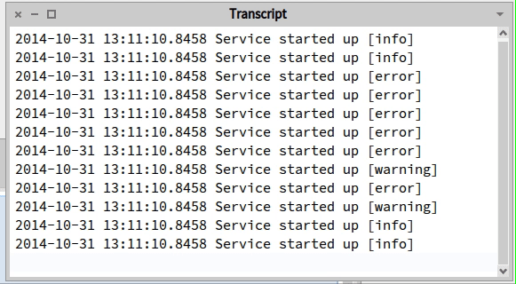

# Routing 
(based on the [offical python tutorial](https://www.rabbitmq.com/tutorials/tutorial-four-python.html))

This communication pattern allows send messages to an specfic route. 


On this tutorial, you'll refine the logging example you did on [previoulsy](PublishSubscribe.md) by sending selectively some of the log messages to a specific error logger. 

Log messages have a severity: `info`, `warning` or `error`.

## Direct exchange

At the code level changes are minor, you will create an exchange of type `direct` instead of `fanout`. A direct exchange sends messages to the queues whose binding key is equal to the routing key of the message.

```Smalltalk
channel declareExchangeNamed: 'better_logs' of: 'direct' applying: [:exchange | ].
result := channel declareQueueApplying: [ :queue | ].
channel queueBind: result method queue exchange: 'better_logs' routingKey: 'error'.
```

And you'll be using the severity labels as binding keys! 

## Logging all messasges to the Transcript

This is the complete code for spawning a logger that will post every message to the Transcript

```Smalltalk
| connection channel result logger |

connection := AmqpConnectionBuilder new
	hostname: 'localhost';
	build.
connection open.

channel := connection createChannel.
channel declareExchangeNamed: 'better_logs' of: 'direct' applying: [:exchange | ].
result := channel declareQueueApplying: [ :queue | ].

#('info' 'warning' 'error') do: [ :severity |
	channel queueBind: result method queue exchange: 'better_logs' routingKey: severity.
].

channel 
	consumeFrom: result method queue
	applying: [ :messageReceived | 
		Transcript show: ('<2s> [<1s>]<n>' 
			expandMacrosWith: messageReceived method routingKey 
			with: messageReceived body utf8Decoded) 
	].	

logger := Process
				forContext:
					[ [ [  connection waitForEvent ] repeat ]
						ensure: [ connection close ]
					] asContext
				priority: Processor activePriority.
logger name: 'Transcript logger'.
	
logger resume 
```

Notice that the queue was bound to every severity

```Smalltalk 
#('info' 'warning' 'error') do: [ :severity |
	channel queueBind: result method queue exchange: 'better_logs' routingKey: severity.
]
```

## Building an error notifier

This is the complete code for spawning a process that will pop up a toast notification on every error message sent. As you may see following the queue creation there's just a binding using the `error` key.

```Smalltalk
| connection channel result logger |

connection := AmqpConnectionBuilder new
	hostname: 'localhost';
	build.
connection open.

channel := connection createChannel.
channel declareExchangeNamed: 'better_logs' of: 'direct' applying: [:exchange | ].
result := channel declareQueueApplying: [ :queue | ].
channel queueBind: result method queue exchange: 'better_logs' routingKey: 'error'.

channel 
	consumeFrom: result method queue
	applying: [ :messageReceived | 
		GrowlMorph 
			openWithLabel: 'Error'
			contents: 'A log message has arrived!' 
			backgroundColor: Color red
			labelColor: Color black ].		

logger := Process
				forContext:
					[ [ [  connection waitForEvent ] repeat ]
						ensure: [ connection close ]
					] asContext
				priority: Processor activePriority.
logger name: 'Error notifier'.
	
logger resume 
```

## Producing logs

This is the script to produce log entries, do not forget to add the severity as routing key

```Smalltalk
| connection channel result |

connection := AmqpConnectionBuilder new
	hostname: 'localhost';
	build.
connection open.

channel := connection createChannel.
channel declareExchangeNamed: 'better_logs' of: 'direct' applying: [:exchange | ].

channel basicPublish: '2014-10-31 13:11:10.8458 Service started up' utf8Encoded exchange: 'better_logs' routingKey: 'info'.	
channel
```

## Running the example




